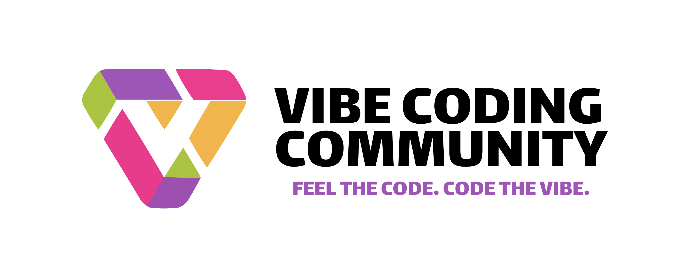

### **Наша цель**  
Мы создаём будущее, где разработка программного обеспечения становится гармоничным симбиозом человеческого гения и искусственного интеллекта. Наша миссия — объединить новаторов, чтобы:  
1. **Сформировать глобальное сообщество** для обмена опытом, идеями и лучшими практиками в сфере ИИ-кодинга.  
2. **Разрабатывать open source-решения**, которые делают программирование быстрее, доступнее и эстетичнее.  
3. **Снижать барьеры** между идеей и её реализацией, используя ИИ для сокращения затрат на разработку.  
4. **Воспитывать новое поколение кодеров**, способных обеспечивать качество сгенерированного ИИ кода.  

### Что такое Vibe Coding?

**Vibe Coding (или «вайб-кодинг»)** — это подход к разработке ПО, при котором программист формулирует задачу на естественном языке, а искусственный интеллект генерирует рабочий код.

### Что такое Vibe Coding Community?

**Vibe Coding Community** — сообщество, где собирают и обсуждают полезные инструменты, лучшие подходы и успешные проекты, созданные с помощью Vibe Coding. Сообщество в котором делятся знаниями и опытом друг с другом.

**VCC Education** — трайб, который занимается созданием образовательных материалов по Vibe Coding: курсы, вебинары и тренинги. Мы систематизируем все, что обсуждалось в VCC Community и делаем из этого крутые курсы!

**VCC Agency** — агентство, которое разрабатывает продукты с помощью ИИ под руководством опытных специалистов, прошедших обучение в VCC Education. Мы делаем разработку на заказ доступной для малого и среднего бизнеса, сокращаем время на создание продуктов и снижаем затраты.

**VCC Crypto** — трайб, который поддерживает Open Source проекты и мотивирует участников вознаграждениями криптовалюты VCC. Если ты автор проекта, ты будешь получать криптовалюту VCC за каждый git clone твоего проекта. Если ты контрибьютор, то за каждую решённую задачу (Issue) или улучшение кода (Pull Request) тоже получаешь VCC.

### Присоединяйся к Vibe Coding Community!

Больше о каждом из трайбов можно узнать в соответствующем разделе нашего сайта.

