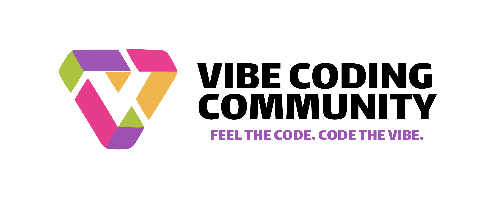

### **Наша цель**  
Мы создаём будущее, где разработка программного обеспечения становится гармоничным симбиозом человеческого гения и искусственного интеллекта. Наша миссия — объединить новаторов, чтобы:  
1. **Сформировать глобальное сообщество** для обмена опытом, идеями и лучшими практиками в сфере ИИ-кодинга.  
2. **Разрабатывать open source-решения**, которые делают программирование быстрее, доступнее и эстетичнее.  
3. **Снижать барьеры** между идеей и её реализацией, используя ИИ как инструмент творчества.  
4. **Воспитывать новое поколение кодеров**, для которых технологии — это не просто строки кода, а способ самовыражения.  

---

### **Наши ценности**  
- **Инновации через простоту**  
  Мы верим, что даже сложные задачи можно решать элегантно. ИИ — наш союзник в поиске нестандартных решений.  
- **Открытость и прозрачность**  
  Наш код, документация и идеи доступны всем. Мы учимся друг у друга и растим сообщество, а не конкурируем.  
- **Креативность как стандарт**  
  Красота кода — в его функциональности и стиле. Мы создаём проекты с «вайбом», где каждая деталь имеет смысл.  
- **Сила сообщества**  
  Хакатоны, митапы, менторские программы — мы верим, что прорывы рождаются в коллаборациях, а не в одиночку.  

---

### **Наши принципы**  
1. **ИИ — инструмент, а не замена**  
   Мы используем искусственный интеллект для ускорения рутинных задач, чтобы сосредоточиться на творческой составляющей кода.  
2. **Код должен быть открытым**  
   Все проекты VCC публикуются на GitHub. Мы поощряем форки, пул-реквесты и совместное развитие идей.  
3. **Обучение через действие**  
   Участие в хакатонах, вебинары от лидеров сообщества, книга «Vibe Coding для начинающих» — мы учимся, создавая.  
4. **Технологии с человеческим лицом**  
   Наши продукты и сервисы (VCC Agency, VCC Crypto) работают для людей, а не ради прибыли.  
5. **Глобальное мышление**  
   Мы говорим на языке кода, который стирает границы. Локальные митапы, международные конкурсы, онлайн-курсы — мир наш дом.  

---

**Присоединяйся к Vibe Coding Community!**  
Здесь нет «новичков» или «гуру» — только те, кто готов менять подход к разработке. Пиши код с душой, делись идеями в Telegram-чате, участвуй в open source-проектах или запусти свой стартап через Vibe Coding Agency. Вместе мы превратим вайб-кодинг в новый стандарт цифровой эпохи.  

*FEEL THE CODE. CODE THE VIBE*  

---

**P.S.** Это не просто манифест — это приглашение в движение.  
Здесь каждый найдет своё место: разработчик, дизайнер, студент или CEO.  
Потому что будущее кода пишется сегодня. И мы пишем его вместе.
